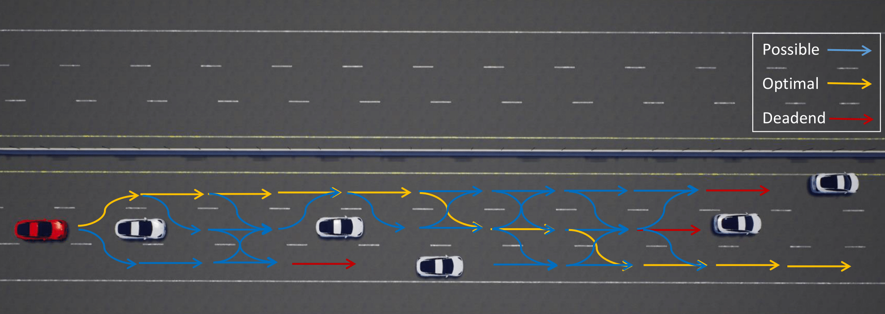

# CC-SSP planner

The following code is the CC-SSP [1] risk-aware planner. The code is based on the DWA planner, mainly the trajectory generation and trajectory scoring.

## Code structure:
* ccssp_planner_ros: acts as a ROS interface by setting the configurable parameters, acquiring the local plan from dwa_planner, and publishing the local plan.
* ccssp_planner: receives the planner parameters, generates the trajectories (using base_local_planner), and acquires the local plan from scored_planner.
* scored_planner: is a modified code that computes the cost of each trajectory based on a set of cost functions, and computes the risk as well, and sends it to the ccssp class.
* ccssp: is the CC-SSP planner file; it uses Gurobi solver to solve the problem using input from scored_planner.
* CCSSPPlanner.cfg: is the configuration file, which includes the risk threshold parameter (risk_cc).

## Items to be done:
1. The risk value is currently based on (base_local_planner::ObstacleCostFunction) that uses the cost_map; however, it is not very accurate and depends on cost_map params (inflation) and robot urdf. Therefore, the parameters must be tuned, or an alternative method must be used to compute risk.
2. The planner should plan for multiple horizons, which involves 1) using the trajectory_genrator to get the set of actions given the state. (note: DWA sampling values should be reduced to reduce the number of actions)
3. The planner should consider dynamic obstacle prediction: 1) add the prediction to the risk computation (should be based on which prediction the Tans function considers)  2) add the prediction probability to the transition function. 3) Add a method to determine which prediction is correct (observation) to select the appropriate action.
4. Replace the package name with ccssp_local_planner: all the imports, CMake files, launch files, and dependencies needs to be changed as well.

[1] Dual Formulation for Chance Constrained Stochastic Shortest Path with Application to Autonomous Vehicle Behavior Planning. IEEE-CDC 2021
